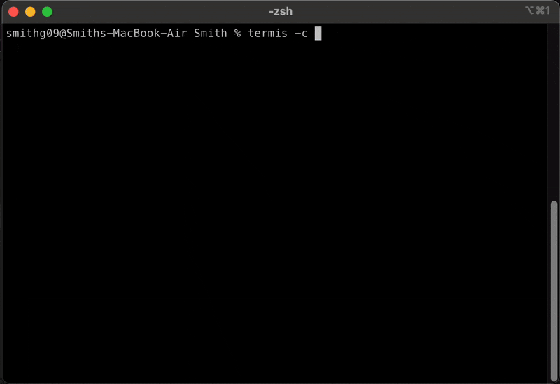

# Termis
Snap your setup into place

Define your iTerm layouts and commands using YAML, then launch everything with a single command — your workspace, ready to go

## Features

* **Multiple Layout Support** - Create complex window layouts with multiple panes and tabs
* **Environment Variable Support** - Use environment variables in your configurations with `!ENV` tag
* **Global Profiles** - Save and reuse configurations as global profiles
* **Interactive Setup Wizard** - Use the wizard mode to create configurations interactively
* **Flexible Pane Management** - Support for complex layouts with advanced position notation (column/row/column_in_row)
* **Command Execution** - Run multiple commands in each pane with optional delays between commands
* **Working Directory** - Set root directory for each tab or individual panes
* **Tool Integration** - Built-in support for:
  * VS Code - Integration with Visual Studio Code
  * Docker - Docker container management
  * Git - Source control operations
* **Dry Run Mode** - Preview configuration changes without applying them
* **iTerm Profile Support** - Use different iTerm profiles for different windows/panes
* **Command Delays** - Configure delays between command executions to handle timing dependencies
* **Global Profile Management** - List, save, and manage global configuration profiles

## Requirements

* iTerm2 Version 3.3 or later
* Python 3.5 or later

## Installation

Make sure that you are running Python 3.5 or later

```shell
pip install termis
```

[Enable Python API usage](./.github/assets/iterm_settings.png) in iTerm settings.

```shell
termis --version
```

## Example
The layout, number of panes, tabs, titles and commands is configurable and is detailed below.



## Usage
Open iTerm and simply run the below command

```shell
termis -c config.yml
```
If you don't provide `-c` flag, termis will look for `termis.yml` file in the current directory and use that.

Here is the list of options available:

```shell
termis [-c,--config <config-file>]  # Path to the configuration file
        [-h,--help]                  # Shows the help screen
        [-v,--version]               # Shows the installed termis version
        [-n,--new]                   # Runs termis in a new window
        [-p,--profile <name>]        # Use a profile from ~/.termis/profiles
        [-w,--wizard]                # Run interactive configuration wizard
        [-d,--dry-run]               # Show what would happen without executing
        [-l,--log-level <level>]     # Set logging level (debug, info, warning, error)
        [-s,--save-global <name>]    # Save current configuration to global profiles
        [-g,--global-list]           # List all available global profiles
        [-t,--tools-check]           # Check availability of development tools
```

## Configuration
Configuration file to set up the sessions has the format below

```yml
profile: "Default"
metadata:
  name: "Development Environment with Advanced Layout"
  description: "Demonstrates the extended pane positioning feature"
  author: "Your Name"
  version: "1.0.0"
tabs:
  development:
    title: "Dev Environment"
    root: "~/Documents/my_project"
    panes:
      - position: "1/1/1"
        title: "Editor"
        focus: true
        badge:
          text: "📝 EDITOR"
          theme: "primary"
        commands:
          - !ENV "db authenticate ${DB_PASSWORD}"
          - "echo 'EDITOR'"
        focus: true
        prompt: "populated command"
  db:
    title: "Database"
    badge: "DB"
    panes:
      - position: "1/1/1"
      - position: "1/2/1"
      - position: "2/1/1"
```

Details for each of the configuration objects above is given below

| Key           | Description                                                                                                                                                                                                                                      |
|---------------|--------------------------------------------------------------------------------------------------------------------------------------------------------------------------------------------------------------------------------------------------|
| `version`     | Refers to the termis configuration version. Should always be 1.                                                                                                                                                                                 |
| `profile`     | Name of the profile you would like to use for all panes. If using `-n` argument to launch a new window, then window specific profile settings will be applied                                                                                    |
| `tabs`        | Windows or tabs in the iTerm window.                                                                                                                                                                                                             |
| `development`    | Replace with the unique project id e.g. `development-pid`                                                                                                                                                                                        |
| `root`        | Root path for all panes within a tab                                                                                                                                                                                                             |
| `title`       | Title to be shown in the title bar of the current tab                                                                                                                                                                                            |
| `badge`       | Set the Badge Text of the pane or provide text and theme keys to customize color scheme                                                                                                                                                                                               |
| `position`    | Position of the pane in the window. Supports two formats: `column/row` or `column/row/column_in_row` for more complex layouts. More details in the Layouts section.                                                                                |
| `focus`       | Pane to be in focus when termis is finished. `focus: true`. There should only be one focus flag per Tab. If multiple are found, it will focus on the last pane evaluated.                                                                       |
| `commands`    | List of commands to execute in the current pane.                                                                                                                                                                                                 |
| `prompt`      | A command which will remain populated in the prompt after all `command`s have finished executing. The `prompt` command itself is not executed automatically.                                                                                     |
| `command_delay`| Delay in seconds between executing commands in a pane. Useful when commands need to wait for previous operations to complete.                                                                                                                      |
| `working_directory` | local path for current pane within a tab |
| `tools`       | Configure tool integrations for the pane. Supports 'vscode', 'docker', and 'git' integrations.                                                                                                                                                     |

## Layouts
The parameter `position` in each pane decides where each of the window panes will be displayed. The position value has the format below

```shell
x / y / z – both x and y are required parameters

x: refers to the column in the window
y: refers to the row of the given column x
z: refers to the column in given row column x+y (used for complex layout structure)
```

Here are some of the examples for different pane layouts

## Single Pane Window

For single pane, since there is one column and one row, the position for pane would be `1/1/1`
```
.------------------.
| 1/1              |
|                  |
|                  |
|                  |
|                  |
|                  |
|                  |
|                  |
|                  |
'------------------'
```
Here is how the configuration would look like
```yml
version: "1.0"
tabs:
  some-project:
    title: "Demo Project"
    panes:
      - title: "Demo Pane"
        position: "1/1/1"
        commands:
          - "yarn dev"
```

## Complex Pane Layout

```
.------------------.------------------.------------------.
| 1/1/1            | 2/1/1            | 3/1/1            |
|                  |                  |                  |
|                  |                  |                  |
|                  |                  |                  |
|                  |                  |------------------|
|--------.---------|                  | 3/2/1            |
|1/2/1   | 1/2/2   |                  |                  |
|        |         |                  |                  |
|        |         |                  |------------------|
|        |         |                  | 3/3/1            |
|        |         |                  |                  |
|        |         |                  |                  |
'--------'---------'------------------'------------------'
```
Configuration for that would be

```yml
tabs:
  complex:
    title: "Complex Layout"
    panes:
      - position: "1/1/1"
      - position: "1/2/1"
      - position: "1/2/2"

      - position: "2/1/1"

      - position: "3/1/1"
      - position: "3/2/1"
      - position: "3/3/1"
```

## Tool Integrations

Termis supports various tool integrations that can be configured per pane:

```yml
panes:
  - position: "1/1"
    tools:
      vscode:
        files: ["file1", "file2"]
      docker:
        # Docker specific configurations
      git:
        # Git specific configurations
```

You can check available tools using:
```shell
termis --tools-check
```

## 🙏 Acknowledgements
Special thanks to [kamranahmedse/itomate](https://github.com/kamranahmedse/itomate) for the original inspiration.
This project is heavily inspired by itomate and builds upon it with additional features tailored to my daily development workflows.

## Contributions
Feel free to submit pull requests, create issues, spread the word.

## License

MIT &copy; [Smith Gajjar](https://github.com/smithg09)